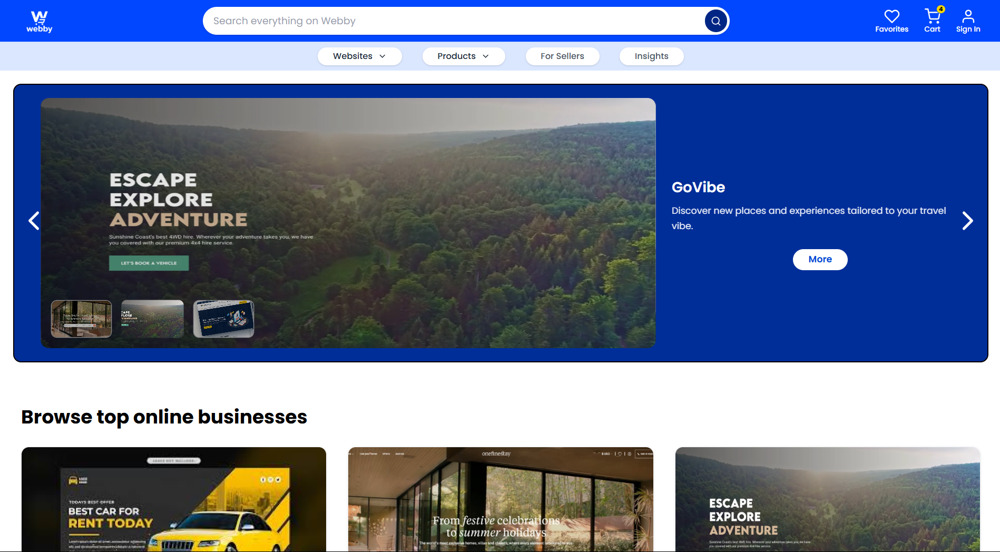

# Webby - Smart Price Comparison & Marketplace



> **Internship Project** | **Frontend Development** | **React & Redux**

## 📖 Project Overview
**Webby** is a modern **Price Comparison & Digital Marketplace** application developed during my internship at **Least Action Company**. It is designed to bridge the gap between digital assets (websites, templates) and physical products (electronics, fashion), introducing a unique **"Rent vs. Buy"** model.

This project demonstrates my proficiency in building scalable **Single Page Applications (SPAs)** with **React**, managing complex global state with **Redux Toolkit**, and implementing responsive, high-quality user interfaces.

## 🚀 Key Features

### 🛒 Advanced Shopping Experience
- **Smart Price Comparison**: Intuitive interface for users to compare product prices and features.
- **Rent vs. Buy Logic**: A hybrid ownership model allowing users to choose between one-time purchases or subscription-based renting for digital assets.
- **Dynamic Cart System**: Fully functional cart with real-time state updates (Add, Remove, Adjust Quantity) powered by **Redux**.

### 📱 Digital & Physical Marketplace
- **Digital Storefront**: Dedicated section for websites, templates, and software solutions.
- **Physical Goods**: Browsing categories for Electronics, Fashion, and Beauty.
- **Category Filtering**: Seamless navigation across diverse product types.

### 🎨 UI/UX Excellence
- **Responsive Design**: Mobile-first architecture ensuring a flawless experience on all devices.
- **Interactive UI**: Engaging user experience with hover effects, smooth transitions, and toast notifications.
- **Seller Dashboard**: Admin interface for managing listings and tracking product performance.

## 🛠️ Technology Stack

| Domain | Technolgies Used |
| :--- | :--- |
| **Frontend Framework** |   |
| **State Management** |  |
| **Styling** |  |
| **Routing** | React Router DOM |
| **Icons** | React Icons |

## 📂 Installation & Setup

Follow these steps to run the project locally:

1.  **Clone the Repository**
    ```bash
    git clone https://github.com/Mathiyarasan2102/WebShopping.git
    cd WebShopping
    ```

2.  **Install Dependencies**
    ```bash
    npm install
    ```

3.  **Run Development Server**
    ```bash
    npm run dev
    ```
    Open `http://localhost:5173` in your browser.

## 📬 Contact & Credits

**Developed by:** Mathiyarasan P
**Role:** MERN Stack Developer Intern
**Linked Projects:** [LuxeEstate](https://github.com/Mathiyarasan2102/LuxeEstate-RealEstate-Website) | [Lumora Photography](https://github.com/Mathiyarasan2102/lumora-photography-cms)

---
*This project was built as part of the internship curriculum at Least Action Company.*
